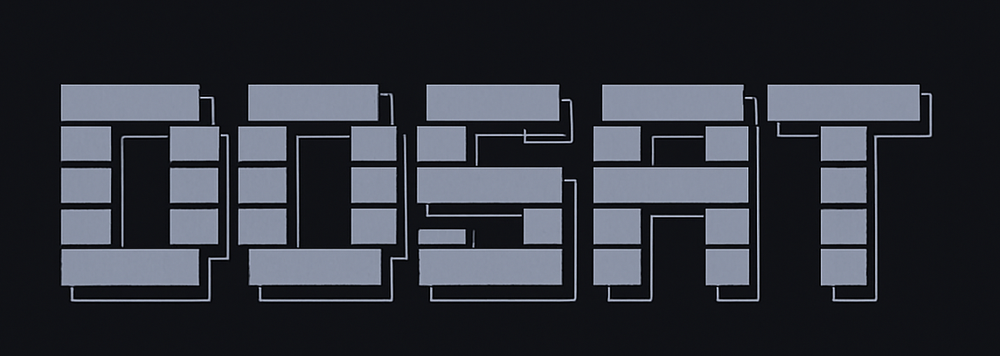

# 🎯 Dōsatsu (洞察)

> **"Insight" in Japanese** - See music industry trends 6-12 months before everyone else

[](https://www.python.org/downloads/)
[](https://opensource.org/licenses/MIT)

**Dōsatsu is a music industry intelligence platform** that analyzes 25+ years of Billboard Hot 100 chart data to reveal which genres are rising, declining, and shifting—before it becomes obvious to everyone else.



---

## 🚀 Quick Start (30 seconds)

```bash
# Clone the repository
git clone https://github.com/supadupaj404/dosatsu.git
cd dosatsu

# Run setup (downloads Billboard data, installs dependencies)
./scripts/setup.sh

# Launch the dashboard
streamlit run dashboard/streamlit_app.py
```

Your browser will open to `http://localhost:8501` with the full Dōsatsu dashboard.

---

## ✨ What You Get

### Real-Time Billboard Analysis
- **25+ years of Billboard Hot 100 data** (2000-2025, updated weekly)
- **5,000+ artists automatically classified** by genre
- **Genre trend tracking** with exact percentages
- **Anomaly detection** ("First time in X years" moments)

### Interactive Dashboard
- Current Hot 100 with genre breakdown
- Year-over-year comparisons
- Decade-by-decade evolution
- Artist search across 11,000+ artists
- Exportable insights

### Automated Weekly Updates
- Set-it-and-forget-it automation
- Runs every Tuesday when Billboard updates
- Zero maintenance required
- Always fresh data

---

## 💡 Key Insights Discovered

### Hip-Hop's Historic Collapse (2025)
- Peaked at **19% in 2018**
- Dropped to **5.6% by 2025**
- **61% decline** in representation
- 9 drought weeks with zero hip-hop in top 40

### Country's Explosive Rise
- 2013: 5.4% → 2023: 20.2%
- **+698% growth in 10 years**
- Still climbing

### Pop's Boom-Bust-Boom Cycle
- 2009-2019: Fell **16.6 percentage points** ← Biggest 10-year decline in history
- Now recovering to 22%+

### Latin's Quiet Takeover
- 2020: 8% → 2025: 20%
- **+150% growth in 5 years**

---

## 🎯 Who It's For

| User Type | Use Case | What You Get |
|-----------|----------|--------------|
| **A&R Executives** | "What genre should we sign next?" | See which genres are rising/declining with exact percentages, spot trends 6-12 months early |
| **Artist Managers** | "How do I position my artist?" | Track your artist's genre viability in real-time, time releases when your genre is trending |
| **Independent Artists** | "What sound should I make?" | Genre viability scores, see what's working now vs. declining |
| **Record Label Executives** | "Where should we allocate marketing budget?" | Portfolio health checks, ROI analysis by genre, budget allocation recommendations |
| **Music Journalists** | "What should I cover?" | Weekly "first time in X years" stories, data-backed hot takes |
| **Music Industry Investors** | "Where is the market moving?" | Market share trends by genre, growth rates, catalog valuation signals |

---

## 📊 Features

### Core Analysis
- ✅ Genre market share tracking (Hip-Hop, Pop, Country, R&B, Rock, Alternative, Latin)
- ✅ Trend detection (Rising 📈, Declining 📉, Stable ➡️)
- ✅ Historical context (25 years of data)
- ✅ Anomaly alerts ("First time since 2007")
- ✅ Artist-level genre classification (via Spotify API)

### Dashboard Pages
1. **Home** - Overview stats and current trends
2. **Current Charts** - Latest Hot 100 with genre breakdown
3. **Year Comparison** - Compare any two years side-by-side
4. **Decade Analysis** - 25-year genre evolution
5. **Artist Search** - Search 11,147 artists by name

### Automation
- **Weekly updates** - Runs every Tuesday at 1 PM (when Billboard updates)
- **Zero maintenance** - Set it up once, runs forever
- **Smart logging** - Track every update with timestamps
- **Error handling** - Graceful failures with detailed logs

---

## 📦 Installation

### Prerequisites
- Python 3.8 or higher
- Git
- Internet connection (for downloading Billboard data)

### Option 1: Automated Setup (Recommended)
```bash
git clone https://github.com/supadupaj404/dosatsu.git
cd dosatsu
./scripts/setup.sh
```

The setup script will:
1. Install Python dependencies
2. Download 25 years of Billboard Hot 100 data
3. Set up directory structure
4. Verify installation

### Option 2: Manual Setup
```bash
# Clone repository
git clone https://github.com/supadupaj404/dosatsu.git
cd dosatsu

# Install dependencies
pip install -r requirements.txt

# Download Billboard data
python3 src/billboard_downloader.py

# Launch dashboard
streamlit run dashboard/streamlit_app.py
```

---

## 🔧 Configuration

### Spotify API (Optional - Enhances Genre Classification)

**⚠️ Security Note:** Never commit your Spotify credentials to git. Use environment variables or Streamlit secrets.

#### Step 1: Get Spotify Credentials
1. Go to https://developer.spotify.com/dashboard
2. Log in with your Spotify account
3. Click "Create App"
4. Fill in:
   - App name: "Dōsatsu"
   - Description: "Billboard chart analysis"
   - Redirect URI: (leave default)
5. Accept terms and create
6. Copy your **Client ID** and **Client Secret**

#### Step 2: Configure Credentials

**For command-line scripts:**
```bash
# Copy the template
cp .env.example .env

# Edit .env and add your credentials
SPOTIFY_CLIENT_ID=your_actual_client_id
SPOTIFY_CLIENT_SECRET=your_actual_client_secret
```

**For Streamlit dashboard:**
```bash
# Create secrets file
mkdir -p dashboard/.streamlit
nano dashboard/.streamlit/secrets.toml

# Add your credentials:
SPOTIFY_CLIENT_ID = "your_actual_client_id"
SPOTIFY_CLIENT_SECRET = "your_actual_client_secret"
```

#### Step 3: Run Genre Classification
```bash
# Load credentials from .env
source .env
python3 scripts/classify_remaining_artists.py
```

**Note:** The `.env` and `secrets.toml` files are gitignored (never committed).

See [SECURITY.md](SECURITY.md) for credential security best practices.
See [docs/SPOTIFY_INTEGRATION_GUIDE.md](docs/SPOTIFY_INTEGRATION_GUIDE.md) for details.

### Weekly Automation (Optional - Keeps Data Fresh)

```bash
# Install weekly automation (macOS only)
./automation/setup_automation.sh
```

This will download fresh Billboard data every Tuesday at 1 PM automatically.

See [docs/AUTOMATION_GUIDE.md](docs/AUTOMATION_GUIDE.md) for details.

---

## 📖 Documentation

- **[Quick Start Guide](docs/QUICKSTART.md)** - Get up and running in 5 minutes
- **[Automation Guide](docs/AUTOMATION_GUIDE.md)** - Set up weekly auto-updates
- **[Deployment Guide](docs/DEPLOYMENT_GUIDE.md)** - Deploy to Streamlit Cloud (free)
- **[Spotify Integration](docs/SPOTIFY_INTEGRATION_GUIDE.md)** - Enhance genre classification
- **[Product Overview](docs/DOSATSU_OVERVIEW.md)** - Deep dive into capabilities

---

## 🗂️ Project Structure

```
dosatsu/
├── README.md                    # You are here
├── requirements.txt             # Python dependencies
├── src/                         # Core source code
│   ├── billboard_downloader.py  # Download Billboard data
│   ├── spotify_classifier.py    # Spotify genre classification
│   └── ...
├── analysis/                    # Analysis scripts
│   ├── genre_tracker.py         # Track genre trends
│   ├── trend_analyzer.py        # Detect anomalies
│   └── ...
├── dashboard/                   # Streamlit web app
│   └── streamlit_app.py         # Main dashboard
├── automation/                  # Weekly update automation
│   └── auto_weekly_update.py    # Automated update script
├── scripts/                     # Utility scripts
│   └── setup.sh                 # First-time setup
├── docs/                        # Documentation
└── data/                        # Data files (gitignored)
    ├── billboard/               # Billboard chart data
    ├── cache/                   # Genre classification cache
    └── logs/                    # Update logs
```

---

## 🎨 Usage Examples

### Example 1: Check Current Genre Trends
```python
from src.billboard_downloader import BillboardDataDownloader
import json

# Download latest data
downloader = BillboardDataDownloader()
data = downloader.download_recent_charts(years=1)

# Get latest week
latest_week = max(data.keys())
print(f"Latest chart week: {latest_week}")
```

### Example 2: Analyze Specific Artist
```bash
# Search for an artist in the dashboard
streamlit run dashboard/streamlit_app.py
# Navigate to "Artist Search" and type the artist name
```

### Example 3: Generate Weekly Insights
```bash
python3 automation/auto_weekly_update.py
# See insights in data/logs/auto_update.log
```

---

## 📈 Data Sources

- **Billboard Hot 100** - Public GitHub repository: [billboard-hot-100](https://github.com/mhollingshead/billboard-hot-100)
- **Spotify API** - Genre classification (free tier, rate-limited)
- **MusicBrainz** - Additional artist metadata (optional)

**Cost:** $0 - All data sources are free

---

## 🤝 Contributing

Contributions are welcome! Here's how you can help:

1. **Report bugs** - Open an issue describing the problem
2. **Suggest features** - Open an issue with your idea
3. **Submit pull requests** - Fork, create a branch, make changes, submit PR
4. **Improve documentation** - Fix typos, add examples, clarify instructions

### Security for Contributors

**IMPORTANT:** Never commit API credentials or secrets!

- ✅ Use environment variables for all credentials
- ✅ Check `.gitignore` before committing
- ✅ Use `.env.example` as a template (never commit actual `.env`)
- ✅ Review [SECURITY.md](SECURITY.md) before contributing

---

## 🔒 Security

Dōsatsu takes security seriously:

- ✅ All API credentials loaded from environment variables
- ✅ No hardcoded secrets in code
- ✅ `.gitignore` protects sensitive files
- ✅ Read-only API access (Spotify can't access your account)

**Found a security issue?** See [SECURITY.md](SECURITY.md) for responsible disclosure.

---

## 📝 License

This project is licensed under the MIT License - see the [LICENSE](LICENSE) file for details.

---

## 🙏 Acknowledgments

- Billboard Hot 100 data from [mhollingshead/billboard-hot-100](https://github.com/mhollingshead/billboard-hot-100)
- Spotify API for genre classification
- Streamlit for the dashboard framework

---

## 💬 Questions?

- **Bug reports:** [Open an issue](https://github.com/supadupaj404/dosatsu/issues)
- **Feature requests:** [Open an issue](https://github.com/supadupaj404/dosatsu/issues)
- **General questions:** Check [docs/](docs/) first

---

## 🚀 Roadmap

- [ ] Multi-chart support (Billboard 200, Global charts)
- [ ] Streaming data integration (Spotify streams vs. charts)
- [ ] Predictive models (forecast genre trends)
- [ ] API endpoint for programmatic access
- [ ] Mobile-responsive dashboard
- [ ] Export to PDF/PowerPoint

---

**Dōsatsu: See the shift before everyone else.** 洞察

Made with ❤️ by [Jeremy Stevenson](https://github.com/supadupaj404) @ Whetstone
